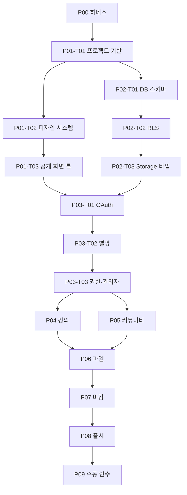

# OnlineLecture MVP 마스터 실행계획

## 사용법

이 문서는 단계, 의존성, 병렬 경계와 요구사항 추적성의 기준이다. 실제 진행 상태는 `docs/tasks/phase-*/*.md` front matter가 원본이며 `docs/tasks/README.md`가 이를 요약한다. `ready` 작업만 담당할 수 있고, 같은 병렬 그룹이어도 `owned_files`가 겹치면 동시에 시작하지 않는다.

## 단계

- P00 하네스: 작업 계약, 공통 규칙, 마스터 계획, 실행 카드, 검사기
- P01 기반: Next.js 기반, 디자인 시스템, 공개 화면 틀
- P02 데이터: 스키마, RLS, Storage 정책과 생성 타입
- P03 신원: Google OAuth, 별명 온보딩, 권한과 관리자 승격
- P04 강의: 회원 재생 화면, 운영자 강의·회차 관리
- P05 커뮤니티: 게시글, 검색, 댓글과 운영자 관리
- P06 파일: 검증·용량, 게시글·회차 첨부, 경고와 실패 복구
- P07 마감: 공통 상태, 접근성·반응형 점검
- P08 출시: 전체 검사, 부하 스모크, Vercel 배포
- P09 수동 인수: OAuth·영상, 이메일·Advisor 최종 확인

## 의존성 그래프

## 작업 목록과 소유권

`상태`는 카드 생성 시 초기값이다. 완료된 P00 작업만 `done`이고 나머지는 선행 작업 완료 전 `blocked`다. P00-T05까지 완료한 같은 상태 변경 커밋에서 P01-T01을 `ready`로 전환한다.

| ID | 산출물 | 초기 상태 | 선행 작업 | 병렬 그룹 | 소유 영역 | 공유·통합 파일 |
| --- | --- | --- | --- | --- | --- | --- |
| P00-T01 | 카드 스키마와 상태 규칙 | done | - | H-A | `docs/tasks/TEMPLATE.md`, `CONTRIBUTING.md` | 하네스 설계 |
| P00-T02 | 공통 작업·비밀·MCP 규칙 | done | - | H-A | `AGENTS.md`, 환경 예시 | 없음 |
| P00-T03 | MVP 의존성과 추적성 | done | P00-T01 | - | 이 마스터 계획 | 없음 |
| P00-T04 | 31개 작업 카드와 대시보드 | blocked | P00-T02,P00-T03 | - | `docs/tasks/phase-*`, 대시보드 | 없음 |
| P00-T05 | 하네스 자동 검사 | blocked | P00-T04 | - | `scripts/check-harness.sh`, 검사 테스트 | `AGENTS.md`, 대시보드 |
| P01-T01 | Next.js·TypeScript·Tailwind·Vitest·Playwright 기반 | blocked | P00-T05 | - | 프로젝트 설정, `src` 기본 구조, Tailwind PostCSS·전역 CSS 진입점, 생성물 제외 | `package.json`, lockfile, 테스트 설정, README |
| P01-T02 | Sera 기반 토큰·폰트·필수 UI | blocked | P01-T01 | F-A | `src/components/ui`, 전역 스타일, 필요한 UI 패키지와 라이선스 기록 | `package.json`과 lockfile은 P01-T02가 통합 소유 |
| P01-T03 | 공개 헤더·모바일 메뉴·홈·오류 틀 | blocked | P01-T01 | F-A | P01-T01 임시 루트 페이지를 교체하는 공개 라우트와 레이아웃 | 루트 레이아웃 통합 소유 |
| P02-T01 | 테이블·제약·인덱스 migration | blocked | P01-T01 | D-A | Supabase 로컬 설정·CLI 생성물 제외와 첫 schema migration | migration 번호 |
| P02-T02 | 역할별 RLS와 SQL 권한 테스트 | blocked | P02-T01 | - | RLS migration·테스트 | migration 번호 |
| P02-T03 | 비공개 Storage 정책과 DB 생성 타입 | blocked | P02-T02 | - | Storage migration, 생성 타입 | 타입 export |
| P03-T01 | Google OAuth·콜백·세션 경계 | blocked | P01-T03,P02-T03 | - | 인증 라우트, Supabase 클라이언트와 인증 패키지 통합 | `package.json`, lockfile, Next.js proxy |
| P03-T02 | 별명 검증·중복 차단·온보딩 | blocked | P03-T01 | - | 서버 인증 온보딩 라우트, 클라이언트 폼, 검증 함수, 액션·페이지 테스트와 별명 CHECK migration·pgTAP | profiles 타입 |
| P03-T03 | 보호 경로·역할 가드·관리자 승격 절차 | blocked | P03-T02 | - | 권한 헬퍼·관리 문서와 후속 admin bootstrap migration·pgTAP | Next.js proxy |
| P04-T01 | 회원 강의 목록·상세·YouTube 플레이어 | blocked | P03-T03 | C-A | 회원 강의 라우트·서버 페이지 테스트와 YouTube 검증 | 공개 레이아웃 없음 |
| P04-T02 | 운영자 강의 CRUD | blocked | P03-T03 | C-A | 관리자 강의 라우트·서버 액션 | 관리자 내비게이션은 통합 소유 |
| P04-T03 | 운영자 회차 CRUD·위아래 순서 이동 | blocked | P04-T02 | - | 회차 관리·순서 로직 | 강의 관리자 화면 |
| P05-T01 | Tiptap 제한 편집기와 게시글 CRUD | blocked | P03-T03 | B-A | 게시글 편집 라우트·콘텐츠 검증·Tiptap 패키지 | `package.json`, lockfile과 README 라이선스 기록은 P05-T01이 통합 소유 |
| P05-T02 | 공개 목록·escaped ILIKE 검색·필터·페이지네이션 | blocked | P05-T01 | - | 게시판 조회 라우트·검색 파서 | 게시판 내비게이션 |
| P05-T03 | 댓글 CRUD·공지·운영자 삭제 | blocked | P05-T02 | - | 댓글·관리 액션 | 게시글 본문 화면 |
| P06-T01 | 파일 allowlist·10MB/3개·80/95% 용량 로직 | blocked | P02-T03 | U-A | 파일·용량 순수 검증 모듈 | 없음 |
| P06-T02 | 게시글 첨부 업로드·서명 다운로드·정리 | blocked | P05-T03,P06-T01 | U-B | 게시글 첨부 서버 로직 | 게시글 편집·본문 통합 소유자 P06-T02 |
| P06-T03 | 회차 자료 업로드·다운로드·삭제 | blocked | P04-T01,P04-T03,P06-T01 | U-B | 회차 첨부 서버 로직 | 회차 관리자·플레이어 통합 소유자 P06-T03 |
| P06-T04 | 80% Resend 1회·재무장·95% 차단/복구 | blocked | P06-T02,P06-T03 | - | 경고 발송·보상 처리 | storage_settings |
| P07-T01 | 오류·404·권한·빈 상태·로딩 공통 마감 | blocked | P04-T03,P05-T03,P06-T04 | Q-A | 공통 상태 컴포넌트·라우트 파일 | 각 기능 연결은 이 작업 소유 |
| P07-T02 | 키보드·포커스·라벨·44px·WCAG AA·모바일 점검 | blocked | P07-T01 | - | 접근성 수정과 Playwright 검사 | 전 기능 UI |
| P08-T01 | lint·typecheck·unit·E2E·build 전체 통과 | blocked | P07-T02 | - | 결함 수정·검증 보고 | 전체 저장소 |
| P08-T02 | 공개 읽기 30개 동시 요청 부하 스모크 | blocked | P08-T01 | R-A | 부하 스크립트·결과 문서 | 없음 |
| P08-T03 | GitHub·Vercel 연결과 배포 문서 | blocked | P08-T01 | R-A | 배포 설정·운영 README | 환경 변수는 Vercel에서만 입력 |
| P09-T01 | 배포 Google OAuth·별명·강의·YouTube 수동 인수 | blocked | P08-T03 | M-A | 수동 증거만 | 외부 Google·YouTube |
| P09-T02 | Resend 경고 도착·Supabase Advisor 수동 인수 | blocked | P08-T03 | M-A | 수동 증거만 | 외부 Resend·Supabase |

## 병렬 실행 규칙

- H-A의 P00-T01/P00-T02는 서로 다른 파일을 소유한다.
- F-A는 P01-T01 뒤 UI 기반과 공개 화면을 병렬화하되 루트 레이아웃은 P01-T03, 패키지 통합은 P01-T01이 소유한다.
- C-A는 회원 강의 화면과 관리자 강의 화면을 분리한다. 관리자 내비게이션은 P04-T02가 통합한다.
- U-B는 공통 P06-T01 완료 후 게시글과 회차 첨부를 분리하며, 공통 경고 상태는 P06-T04만 수정한다.
- R-A와 M-A는 각각 파일 소유권과 외부 계정이 분리된다.
- migration 번호, `package.json`/lockfile, Next.js proxy, 공용 타입과 route export는 표에 지정된 통합 작업 외에는 수정하지 않는다.
- P03 migration은 P03-T02의 `202608070004_profile_nickname_constraint.sql`, P03-T03의 `202608070005_admin_bootstrap.sql` 순서로 통합한다.

## 외부 체크포인트

| 시점 | 필요한 사용자 작업 | 해제되는 작업 |
| --- | --- | --- |
| P02 시작 전 | Supabase 개발 프로젝트 생성 | P02 실제 적용 검증 |
| P04 완료 전 | 공개 YouTube 테스트 영상 준비 | P04-T01 브라우저 검증 |
| P06-T04 전 | Resend 계정·계정 소유자 수신 주소 준비 | P06-T04 실제 발송 검증 |
| P08-T03 전 | GitHub 저장소·Vercel 프로젝트 연결 | P08-T03 |
| P09 전 | Google Cloud OAuth 앱·기본 신원 범위·Supabase Provider·Vercel 리디렉션 URL 등록 | P09-T01 |

첫 로그인 사용자의 `admin` 승격은 P03-T03의 버전 관리 migration 또는 관리 쿼리로 한 번만 수행하며 역할 편집 UI는 만들지 않는다.

## 요구사항 추적성

| 설계 요구 | 작업 ID |
| --- | --- |
| Next.js App Router, TypeScript, Tailwind v4, Vitest, Playwright | P01-T01 |
| Sera, 지정 색상·폭·간격·모서리, Noto 글꼴, 공식 shadcn만 사용 | P01-T02 |
| 공개 홈·게시판과 회원/관리자 경로 | P01-T03, P03-T03, P04-T01, P05-T02 |
| 라이선스와 설치 버전 기록 | P01-T01, P01-T02 |
| 테이블·인덱스·별명 유일성·회차 순서 | P02-T01 |
| 비회원/회원/작성자/운영자 RLS와 미공개 강의 | P02-T02 |
| 비공개 Storage와 만료형 URL 기반 | P02-T03, P06-T02, P06-T03 |
| Google OAuth·별명 2~20자·관리자 승격 | P03-T01, P03-T02, P03-T03 |
| 여러 강의·빈 회차·YouTube URL/ID/썸네일·순서 이동 | P04-T01, P04-T03 |
| Tiptap JSON·허용 기능·본문 1~20,000자·제목 1~120자 | P05-T01 |
| escaped ILIKE·공지 우선·최신순·20개·강의 필터 | P05-T02 |
| 댓글 1~2,000자·본인/타인/운영자 권한 | P05-T03 |
| 파일 allowlist·위장 MIME·10MB·대상당 3개 | P06-T01 |
| DB 실패 객체 정리·삭제 실패를 성공 처리하지 않음 | P06-T02, P06-T03, P06-T04 |
| 1GB 기준 80% 이메일 1회·80% 아래 재무장·95% 차단과 삭제 후 복구 | P06-T01, P06-T04 |
| 오류·404·권한·빈 상태·로딩 | P07-T01 |
| 키보드·포커스·라벨·44px·WCAG AA·모바일 메뉴 | P07-T02 |
| lint, typecheck, 단위, Playwright E2E, production build | P08-T01 |
| 워밍업 후 공개 읽기 30개 동시 요청 반복·HTTP 오류 0 | P08-T02 |
| Vercel 공개 배포와 환경 변수 | P08-T03 |
| 실제 OAuth·YouTube·Resend 이메일·Supabase Advisor | P09-T01, P09-T02 |

## 명시적 제외

결제, 무료 수강 신청, 진도율, 수료증, 좋아요, 실시간 알림, 영상 업로드·보호, 악성 문서 바이러스 검사, 다크 모드, ORM, 전역 상태관리, React Hook Form, 별도 검색 엔진과 CMS는 어떤 카드에도 포함하지 않는다. 검색 성능 문제가 측정될 때만 PostgreSQL 전문 검색을, 상업화 전에 유료 플랜·약관·개인정보·회원 전용 영상·악성 파일 검사·백업을 별도 계획한다.
